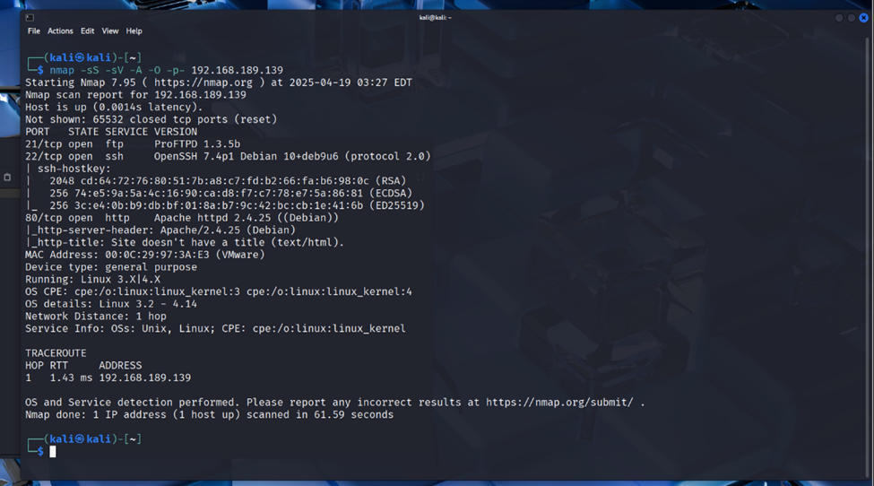

# Symfonos 3 Walkthrough

This write-up demonstrates how to approach and exploit the **Symfonos 3** vulnerable machine using Kali Linux tools.  
The process follows a standard penetration testing methodology: reconnaissance, enumeration, exploitation, and privilege escalation.  

---

## Section 1: Reconnaissance (Information Gathering)

Once the Symfonos 3 VM is running, note the IP address it displays.  
This simulates the victim machine’s IP address in a real-world scenario.  

### Full Port Scan
Use **nmap** to scan all ports and detect services:  

```bash
nmap -p- -sC -sV <target-ip>
```


  


